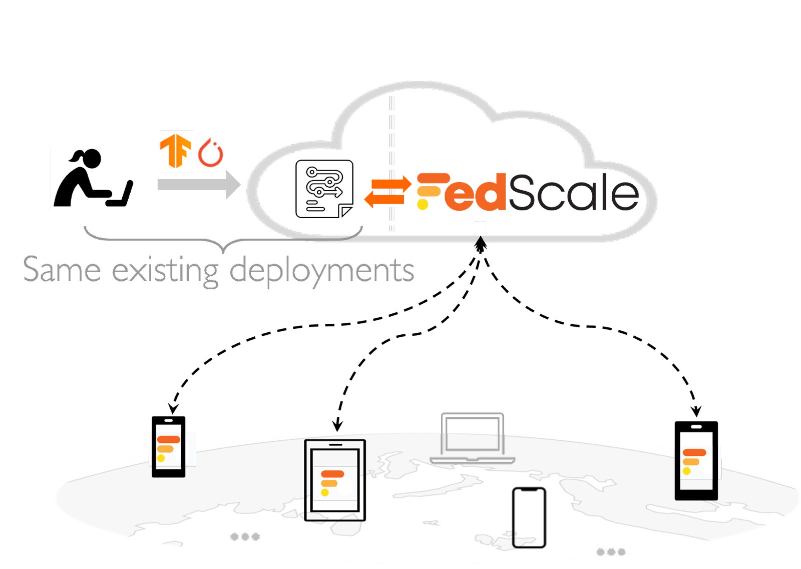

# FedScale Deployment

FedScale provides a cloud-based [aggregation service](https://github.com/SymbioticLab/FedScale/blob/master/fedscale/cloud/aggregation/README.md) and an SDK for smartphones on the edge that currently supports TensorflowLite and Alibaba MNN on Android (iOS support coming soon!). In this tutorial, we introduce how to:

- Initiate FedScale Cloud Service
- Import FedScale SDK to locally fine tune models
- Connect to FedScale cloud for federated training




## FedScale Cloud Aggregation

You may follow these steps to deploy and run the cloud server specific to [Alibaba MNN](https://github.com/SymbioticLab/FedScale/fedscale/edge/mnn/) or [TFLite](https://github.com/SymbioticLab/FedScale/fedscale/edge/tflite/).

- Specify number of executors `num_participants: 1`. You may add more mobile participants to any number you want. We currently only support all participant in one single training backend.

- Specify `model`. Currently we have only tested `linear` models for Alibaba MNN backend because Alibaba MNN does not support Dropout. However, you may choose one of `linear`|`mobilenetv3`|`resnet50`|`mobilenetv3_finetune`|`resnet50_finetune` models. `finetune` means that only the last 2 linear layers will be trained, but the backbone layers will be frozen.

- Set `use_cuda` flag to `True` if you want to use GPU for aggregation. However, as aggregation process is sequential addition of several small tensors, GPU acceleration is very little.

- Submit job

	```
	cd $FEDSCALE_HOME/docker
	python3 driver.py submit $FEDSCALE_HOME/benchmark/configs/android/mnn.yml # If you want to run MNN backend on mobile.
	python3 driver.py submit $FEDSCALE_HOME/benchmark/configs/android/tflite.yml # If you want to run TFLite backend on mobile.
	```

- Check logs: FedScale will generate logs under `data_path` you provided by default. Keep in mind that k8s may load balancing your job to any node on the cluster, so make sure you are checking the `data_path` on the correct node.

- Stop job

	```
	cd $FEDSCALE_HOME/docker
	python3 driver.py stop $YOUR_JOB
	```

## FedScale Mobile Runtime

We provide a sample app which you can choose to 
- Train/test models with TFLite or Alibaba MNN.
- Fine-tune models locally **after** receiving model from the cloud.

Please follow these steps to download and build the sample android app.

1. Download and unzip [sample dataset (TrainTest.zip)](https://drive.google.com/file/d/1nfi3SVzjaE0LPxwj_5DNdqi6rK7BU8kb/view?usp=sharing) to `assets/` directory. Remove `TrainTest.zip` after unzip to save space on your mobile device. After unzip, you should see 3 files and 2 directories under `assets/`:
   1. `TrainSet`: Training set directory, contains 320 images.
   2. `TestSet`: Testing set directory, contains 32 images.
   3. `conf.json`: Configuration file for mobile app.
   4. `train_labels.txt`: Training label file with format `<filename> <label>`, where `<filename>` is the path after `TrainSet/`.
   5. `test_labels.txt`: Testing label file with the same format as `train_labels.txt`.
2. Install [Android Studio](https://developer.android.com/studio) and open project `fedscale/edge/tflite`. Download necessary SDKs, NDKs and CMake when prompted. My version:
    - SDK: API 32
    - Android Gradle Plugin Version: 3.5.3
    - Gradle Version: 5.4.1
    - Source Compatibility: Java 8
    - Target Compatibility: Java 8
3. Modify `conf.json` and dataset.
   - You must modify `aggregator.ip` & `aggregator.port` to your own server.
   - You can choose your training framework by modifying `model_conf.backend` to `tflite` or `mnn`.
   - You may config your dataset information at `training_conf` and `testing_conf`.
   - You may put your own **image classification** dataset under `/TrainSet` and `/TestSet` directories and modify `train_labels.txt` and `test_labels.txt` accordingly. The format of labels must be \<filename\> \<label\>.
   - If you want to perform tasks other than image classification, you should modify framework-specific code [MNN](https://github.com/SymbioticLab/FedScale/fedscale/edge/android/app/src/main/java/com/fedscale/android/mnn) [TFLite](https://github.com/SymbioticLab/FedScale/fedscale/edge/android/app/src/main/java/com/fedscale/android/tflite). If you are using TFLite, you should also write your own signatures similar to [our TFLite model provider](https://github/com/SymbioticLab/FedScale/fedscale/cloud/internal/tflite_model_adapter.py)
4. Make Project. Android Studio will compile and build the app for you. Click Run if you want to run the app on a real android device.

----
If you need any further help, feel free to contact FedScale team or the developer [website](https://continue-revolution.github.io) [email](mailto:continuerevolution@gmail.com) of this app.
